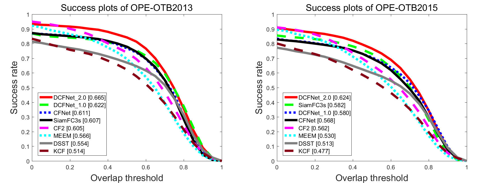

### DCFNET: DISCRIMINANT CORRELATION FILTERS NETWORK FOR VISUAL TRACKING<sub>([arXiv](https://arxiv.org/pdf/1704.04057.pdf))</sub>

By Qiang Wang, Jin Gao, Junliang Xing, Mengdan Zhang, Weiming Hu

### Introduction


> Discriminant Correlation Filters (DCF) based methods now become a kind of dominant approach to online object tracking. The features used in these methods, however, are either based on hand-crafted features like HoGs, or convolutional features trained independently from other tasks like image classification. In this work, we present an *end-to-end lightweight* network architecture, namely **DCFNet**, to learn the convolutional features and perform the correlation tracking process simultaneously.

## Contents
1. [Requirements](#requirements)
2. [Tracking](#tracking)
3. [Training](#training)
4. [Results](#results)
5. [Citation](#citing-dcfnet)

## Requirements

```
git clone --depth=1 https://github.com/foolwood/DCFNet.git
```

Requirements for MatConvNet 1.0-beta24 \(see: [MatConvNet](http://www.vlfeat.org/matconvnet/install/)\)

1. Downloading MatConvNet

```
cd <DCFNet>
git clone https://github.com/vlfeat/matconvnet.git
```

2. Compiling MatConvNet

Run the following command from the MATLAB command window:
```
cd matconvnet
run matlab/vl_compilenn
```

[**Optional**]

 If you want to reproduce the speed in our paper, please follow the [website](http://www.vlfeat.org/matconvnet/install/) to compile the **GPU** version.

## Tracking

The file `demo/demoDCFNet.m` is used to test our algorithm.

To reproduce the performance on [**OTB**](http://cvlab.hanyang.ac.kr/tracker_benchmark/index.html) , you can simple copy `DCFNet/` into OTB toolkit.

[**Note**] Configure MatConvNet path in `tracking_env.m`

## Training

1.Download the training data. ([**VID**](data))

2.Data Preprocessing in MATLAB.

```matlab
cd training/dataPreprocessing
data_preprocessing();
analyze_data();
```

3.Train a DCFNet model.

```
train_DCFNet();
```

## Results

**DCFNet** obtains a significant improvements by

- Good Training dataset. (TC128+UAV123+NUS_PRO -> VID)
- Good learning policy. (constant 1e-5  ->  logspace(-2,-5,50))
- Large padding size. (1.5  -> 2.0)

The OPE/TRE/SRE results on OTB [BaiduYun](http://pan.baidu.com/s/1boKcXkF) or [GoogleDrive](https://drive.google.com/open?id=0BwWEXCnRCqJ-SHNaYUJwaW81R1E).



## Citing DCFNet

If you find [**DCFNet**](https://arxiv.org/pdf/1704.04057.pdf) useful in your research, please consider citing:

```
@article{wang17dcfnet,
    Author = {Qiang Wang, Jin Gao, Junliang Xing, Mengdan Zhang, Weiming Hu},
    Title = {DCFNet: Discriminant Correlation Filters Network for Visual Tracking},
    Journal = {arXiv preprint arXiv:1704.04057},
    Year = {2017}
}
```
