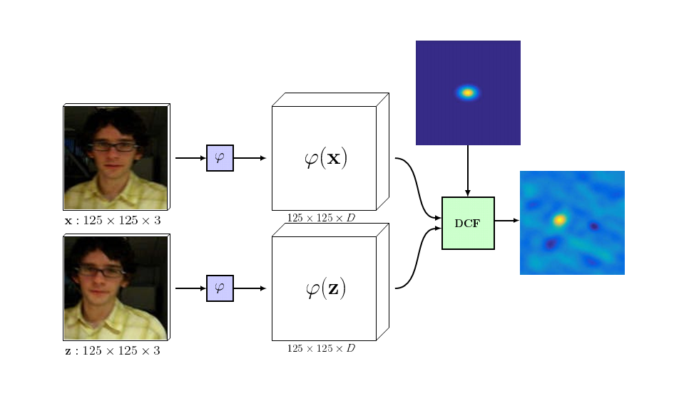
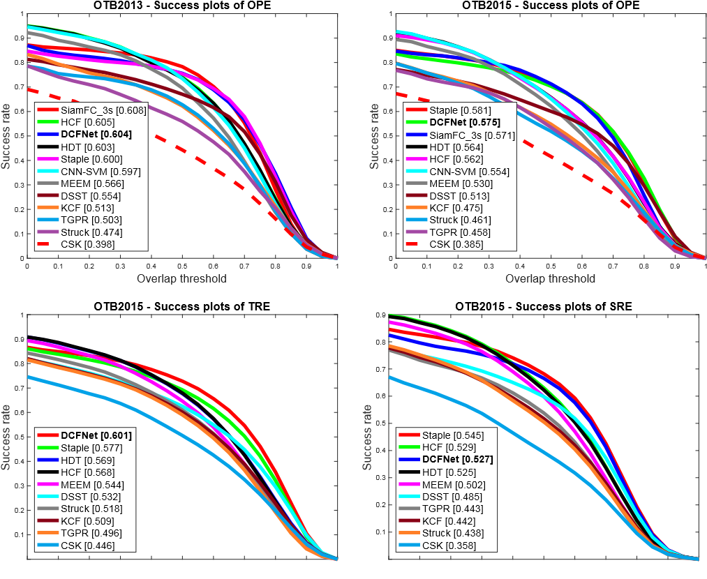
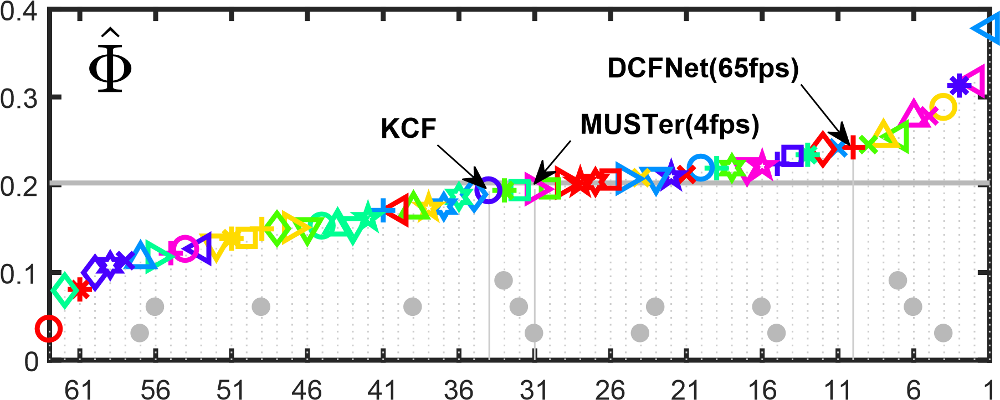

#### DCFNET: DISCRIMINANT CORRELATION FILTERS NETWORK FOR VISUAL TRACKING

By Qiang Wang, Jin Gao, Junliang Xing, Mengdan Zhang, Weiming Hu 

#### Introduction



> Discriminant Correlation Filters (DCF) based methods now become a kind of dominant approach to online object tracking. The features used in these methods, however, are either based on hand-crafted features like HoGs, or convolutional features trained independently from other tasks like image classification. In this work, we present an *end-to-end lightweight* network architecture, namely **DCFNet**, to learn the convolutional features and perform the correlation tracking process simultaneously. 

#### Requirements: software

Requirements for MatConvNet 1.0-beta23(see: [MatConvNet](http://www.vlfeat.org/matconvnet/))

#### Tracking

For simple test our algorithm, you can run `demo_DCFNet.m`.

To verify [**OTB**](http://cvlab.hanyang.ac.kr/tracker_benchmark/index.html) and [**VOT**](http://www.votchallenge.net/) performance, you can simple copy `DCFNet` in OTB or integrate `track4vot` to VOT toolkit.

#### Training

1.Download the training data.

**TColor-128**:[[LINK](http://www.dabi.temple.edu/~hbling/data/TColor-128/Temple-color-128.zip)]

**UAV123** : [[GoogleDrive](https://goo.gl/iQf0Y7)]

**NUS_PRO**:[GoogleDrive] ([part1](https://drive.google.com/drive/folders/0B6eYf2Rj8c79Smk4Q1BxU1ROS28))([part2](https://drive.google.com/folderview?id=0BwFzRq8t3gu5VWFRNGp5dlBkSU0&usp=sharing))]

It should have this basic structure

```
data
    |-- NUS_PRO
    |-- Temple-color-128
    |-- UAV123
```

2.Run training scripts.

```
train_cnn_dcf.m
```

You can choose the network architecture by setting `opts.networkType = 16`(ICIP default is  16)

#### Results

**VOT2015 EAO result**




#### cite

